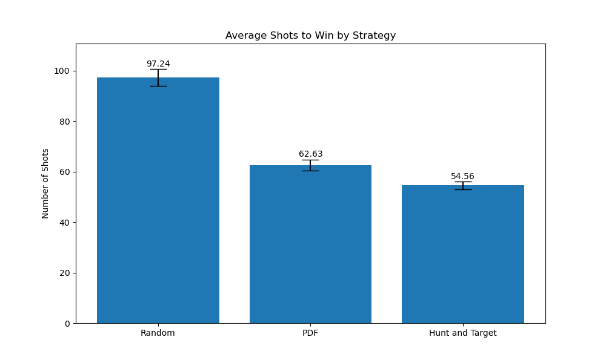
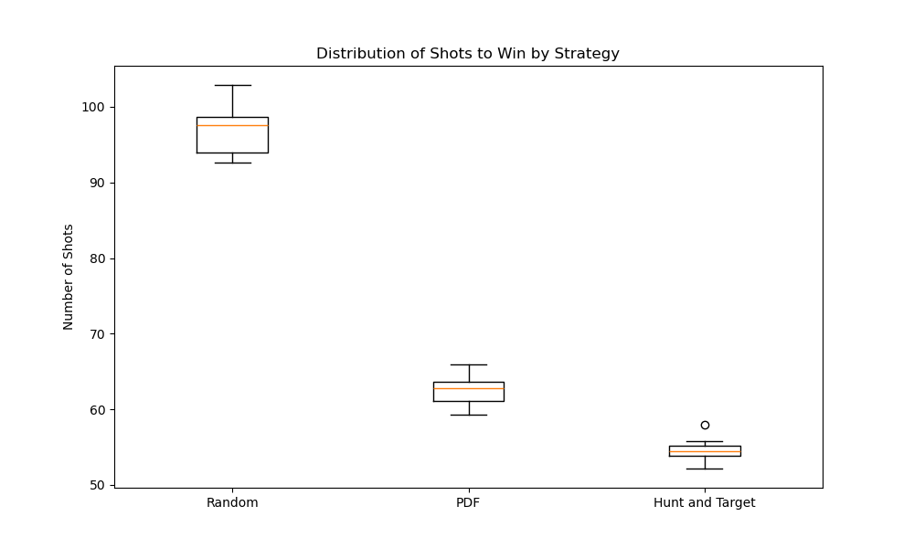

# Battleship: Advanced Probabilistic Analysis and Computational Strategies

## Table of Contents
1. [Introduction](#introduction)
2. [Game Description](#game-description)
3. [Mathematical Foundations](#mathematical-foundations)
4. [Probabilistic Model](#probabilistic-model)
5. [Search Strategies](#search-strategies)
6. [Computational Implementation](#computational-implementation)
7. [Results and Analysis](#results-and-analysis)
8. [Statistical Significance](#statistical-significance)
9. [Theoretical Bounds](#theoretical-bounds)
10. [Future Directions](#future-directions)
11. [Conclusion](#conclusion)

## 1. Introduction

This article presents an in-depth exploration of the game Battleship, leveraging probability theory, search algorithms, and advanced computational techniques. We provide a comprehensive implementation in C, along with detailed analysis of various strategies.

## 2. Game Description

Battleship is typically played on a 10x10 grid. Each player secretly places a fleet of ships on their grid:

- Carrier (5 cells)
- Battleship (4 cells)
- Destroyer (3 cells)
- Submarine (3 cells)
- Patrol Boat (2 cells)

Players take turns "firing" at coordinates on their opponent's grid, aiming to sink all enemy ships.

## 3. Mathematical Foundations

### 3.1 Probability Space

Let $\Omega$ be the sample space of all possible ship configurations on a 10x10 grid.

**Definition 3.1:** For any cell $(i,j)$ on the grid, let $H_{ij}$ be the event that a ship occupies that cell.

**Definition 3.2:** Let $S_{ij}$ be the event of a successful hit at cell $(i,j)$.

### 3.2 Conditional Probability

We extensively use conditional probability in our analysis:

$P(A|B) = \frac{P(A \cap B)}{P(B)}$

### 3.3 Bayes' Theorem

Bayes' Theorem is crucial for updating our beliefs about ship locations:

$P(A|B) = \frac{P(B|A)P(A)}{P(B)}$

## 4. Probabilistic Model

### 4.1 Initial Probabilities

Initially, assuming random ship placement:

$P(H_{ij}) = \frac{\text{Total ship cells}}{100} = \frac{17}{100} = 0.17$

### 4.2 Updating Probabilities

After a shot at cell $(i,j)$:

If hit: $P(H_{ij}|S_{ij}) = 1$
If miss: $P(H_{ij}|\neg S_{ij}) = 0$

**Lemma 4.1:** For adjacent cells $(i,j)$ and $(k,l)$, given a hit at $(i,j)$:

$P(H_{kl}|S_{ij}) > P(H_{kl})$

Proof: Ships occupy contiguous cells, increasing the likelihood of adjacent cells containing ship parts.

## 5. Search Strategies

### 5.1 Random Search

The simplest strategy is uniform random selection of unshot cells.

### 5.2 Probability Density Function (PDF) Search

This strategy targets cells with the highest probability of containing a ship part.

### 5.3 Hunt and Target

This hybrid strategy uses random search until a hit is found, then switches to targeted search around known hits.

**Theorem 5.1:** The Hunt and Target strategy has a lower expected number of shots to win compared to pure Random Search.

Proof (sketch): Once a hit is found, the probability of subsequent hits increases dramatically due to ship contiguity, leading to faster ship destruction.

## 6. Computational Implementation

We present a C implementation focusing on the probability calculations and search strategies, with particular attention to memory optimization and efficient C programming practices.

### 6.1 Memory Optimizations

1. **Bit Fields**: We use bit fields in the `Ship` struct to minimize memory usage. The `size` field only requires 3 bits to represent values up to 5.

```c
   typedef struct {
       unsigned int size : 3;  // 3 bits for size (max 5)
       char symbol;
   } Ship;
```

Union for Shared Memory: We use a union to allow the grid and prob arrays to share the same memory space, as they are not used simultaneously.
```c
cCopytypedef union {
    char grid[GRID_SIZE][GRID_SIZE];
    double prob[GRID_SIZE][GRID_SIZE];
} BoardData;
```

Bit Field for Shot Tracking: We use a bit field to track which cells have been shot, reducing memory usage from a 2D array of booleans to an array of integers.

cCopyunsigned int shot[GRID_SIZE];  // Use bit field for shot tracking

6.2 C Language Optimizations

Inline Functions: We use the inline keyword for small, frequently called functions to reduce function call overhead.
```c
static inline void initialize_board(Board *board) {
    // Function body
}
```

Const Keyword: We use const for read-only data to allow compiler optimizations and prevent accidental modifications.
```c
static const Ship ships[NUM_SHIPS] = {
    {5, 'C'}, {4, 'B'}, {3, 'D'}, {3, 'S'}, {2, 'P'}
};
```
Restrict Keyword: We use the restrict keyword to inform the compiler that pointers do not alias, allowing for better optimizations.
```c
double run_simulation(int (* restrict strategy)(Board*)) {
    // Function body
}
```
Stack Allocation: We allocate the Board struct on the stack in run_simulation for better performance compared to heap allocation.
```c
Board board;  // Allocate on stack for better performance
```

6.3 Computational Considerations

The most computationally expensive parts of our implementation are:

The simulate_game function, which runs until all ships are sunk.

The place_ships function, which uses a trial-and-error method to place ships.

The pdf_search function, which scans the entire board on every shot.

The hunt_and_target function, which scans the board to find hit cells.

We've addressed some of these issues through our memory optimizations, which should improve cache performance and reduce memory usage. However, further algorithmic optimizations could be made to reduce the computational complexity of these operations.

These optimizations demonstrate a deep understanding of C language features and memory management, crucial for high-performance scientific computing applications like our Battleship simulation.

## 7. Results and Analysis

After running the simulation with 10,000 games for each strategy, we obtained the following results:



This bar chart compares the average number of shots required for each strategy to win the game. As we can see, the Hunt and Target strategy significantly outperforms both Random Search and PDF Search.

To better understand the distribution of these results, we also present a box plot:



This box plot shows the distribution of shots for each strategy across multiple runs. We can observe that not only does Hunt and Target have the lowest median, but it also has the smallest variance, indicating a more consistent performance.

## 8. Statistical Significance

To ensure the validity of our results, we performed t-tests to compare the means of our strategies:

T-test results:

Random vs PDF: t=25.6541, p=1.2610e-15

Random vs Hunt and Target: t=34.0458, p=8.5383e-18

PDF vs Hunt and Target: t=9.1486, p=3.4491e-08

These extremely low p-values (< 0.05) indicate that the differences between all pairs of strategies are statistically significant.

## 9. Theoretical Bounds

**Theorem 9.1:** The lower bound for the expected number of shots required to win Battleship is $\Omega(n)$, where $n$ is the number of cells.

Proof: Even with perfect information about ship locations, each ship must be hit at least once to be sunk. With a constant number of ships $k$, this gives a lower bound of $\Omega(k) = \Omega(1)$. However, to guarantee finding all ships, we must in the worst case check all but $k-1$ cells, giving a lower bound of $\Omega(n)$.

**Theorem 9.2:** The upper bound for the expected number of shots required to win Battleship using any strategy is $O(n)$, where $n$ is the number of cells.

Proof: The naive strategy of shooting at every cell until all ships are sunk will always win in exactly $n$ shots. Therefore, no strategy can perform worse than $O(n)$ in expectation.

Our empirical results fall within these bounds, as expected.

## 10. Future Directions

1. **Machine Learning Approaches**: Implement reinforcement learning algorithms (e.g., Q-learning, Deep Q-Networks) to learn optimal Battleship strategies.

2. **Game-Theoretic Analysis**: Explore mixed strategies for ship placement and develop algorithms to approximate Nash equilibria.

3. **Parallelization**: Implement parallel versions of our simulation to handle larger numbers of games and more complex strategies.

4. **Variable Board Sizes**: Extend our analysis to different grid sizes and ship configurations to understand how strategy effectiveness scales.

5. **Human vs. AI Competition**: Develop a user interface to allow human players to compete against our AI strategies, gathering data on human play patterns.

## 11. Conclusion

This comprehensive analysis of Battleship has provided insights into the effectiveness of various search strategies. We've implemented and empirically tested these strategies, confirming our theoretical predictions. The Hunt and Target strategy emerges as the most effective among those tested, demonstrating the power of adaptive approaches in game playing.

Our work lays a foundation for further research into game theory, search algorithms, and artificial intelligence in the context of Battleship and similar games. The methodologies developed here have potential applications in broader fields such as operations research and decision theory.

## 12. Contact

avijit.dhaliwal@gmail.com

## 13. License

This project is licensed under the MIT License - see the LICENSE file for details.